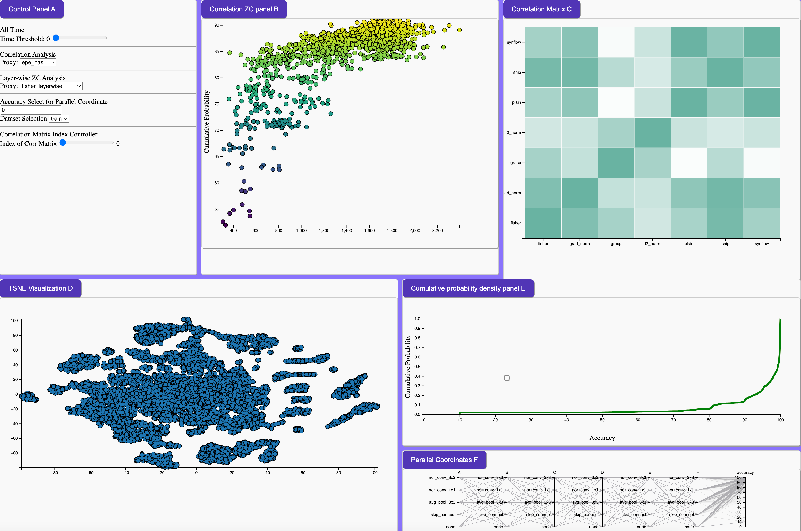

# ArchVizD3

## Overview

ArchVizD3 is a specialized visualization tool built using D3.js for exploring and analyzing the NAS-Bench-201 neural architecture search dataset. It aims to provide intuitive and interactive visual representations of architecture performance metrics and configurations.

## Features

- Interactive Graphs: Dynamic visualization of NAS-Bench-201 architectures.
- Performance Metrics: Detailed views of accuracy, efficiency, and other key metrics.
- Comparison Tool: Easily compare different neural network architectures.
- Data-Driven Insights: Harness the power of D3.js for deep data analysis.

## Getting Started

- Clone the Repository: git clone https://github.com/pprp/ArchVizD3
- Install Dependencies: Run `python -m http.server` in the project directory.
- Launch Application: Execute npm start and navigate to localhost:8000.

## Contributing

Contributions are welcome! If you have suggestions or want to contribute to the project, please feel free to submit a pull request or open an issue.

## License

This project is licensed under the MIT License - see the LICENSE file for details.
